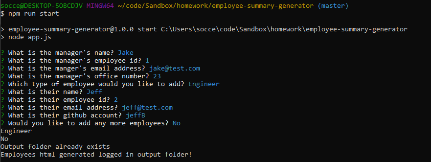
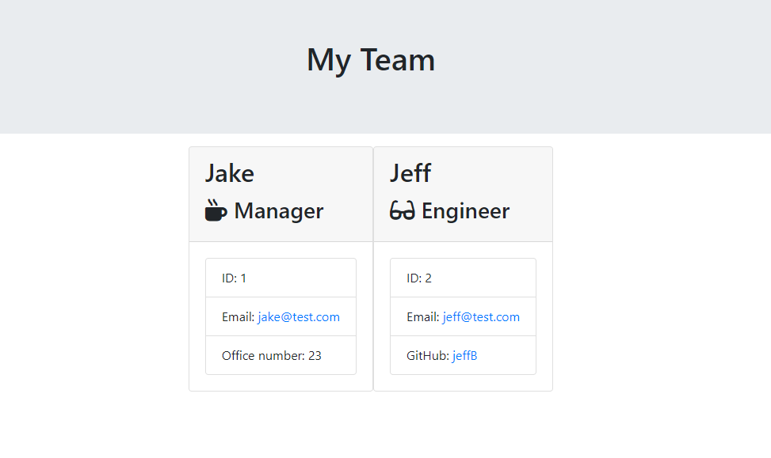

# employee-summary-generator   
## Description  
This is a CLI (command line interface) app will ask input for input from the user to create a work team.  The team will have one manager, and any number of engineers and interns.  Each employee entry will require a name, id and email address.  Each manager will require an office number, engineer will require a github account and intern will require a university.  Once all employees are added.  The html page will be generated and saved to a file called team.html in the output folder.
 

## Table of Contents
  * [Description](#Description)
  * [Screenshots](#Screenshots)
  * [Installation](#Installation)
  * [Usage](#Usage)
  * [License](#License)
  * [Contributing](#Contributing)
  * [Test](#Tests)
  * [Questions](#Questions)
 

## Screenshots

## Installation
Clone the repo from my github account.  You will need to run npm i to install any dependencies for the app.
 

## Usage
Run npm run start to run the app.
 

## License
This application is covered under the [MIT](https://www.opensource.org/licenses) license.
 

## Contributing
Please submit any issues or questions through the github repo issues page.
 

## Tests
You can run tests using Jest.  When you run the npm i to install dependencies, jest will be installed as well.  There are currently 14 test and the app is passing all of them.
 

## Questions
If you have any questions, feel free to find me on github, [jburz](https://www.github.com/jburz) or send me an email at jake.bilbao.04.06@gmail.com.
  